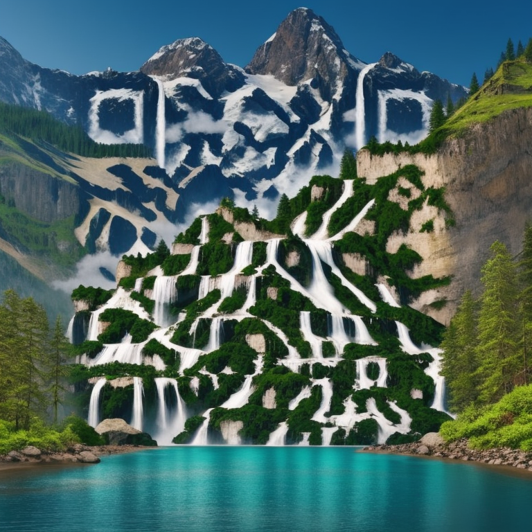
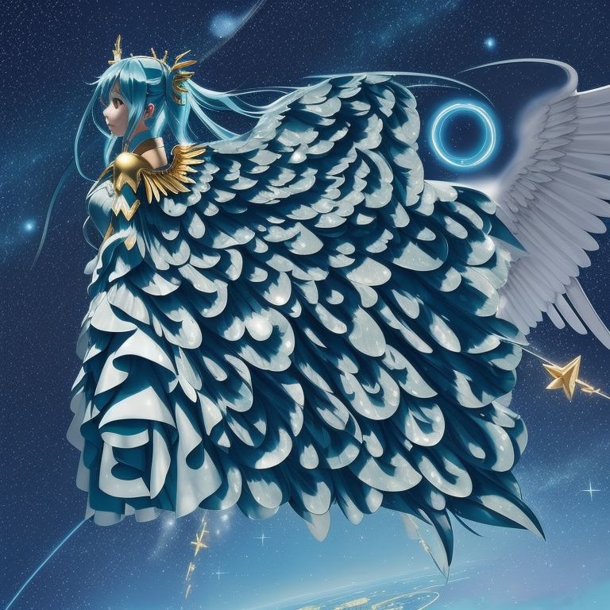
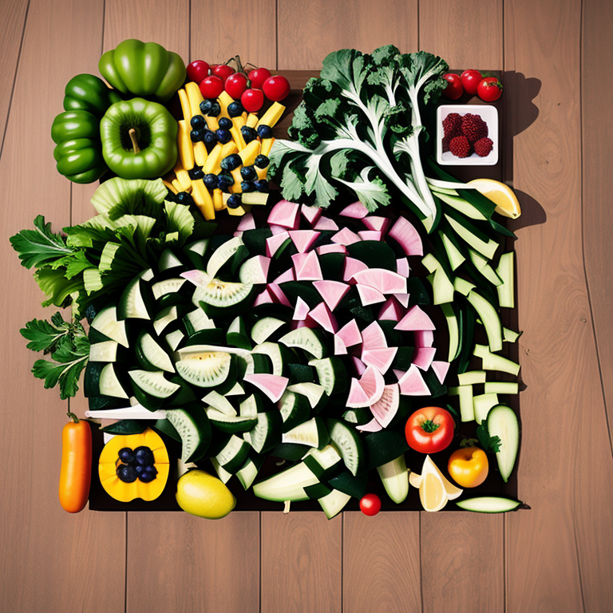
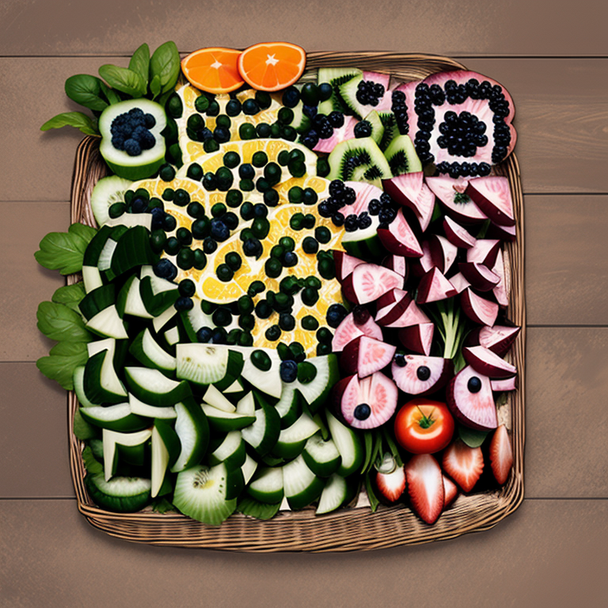
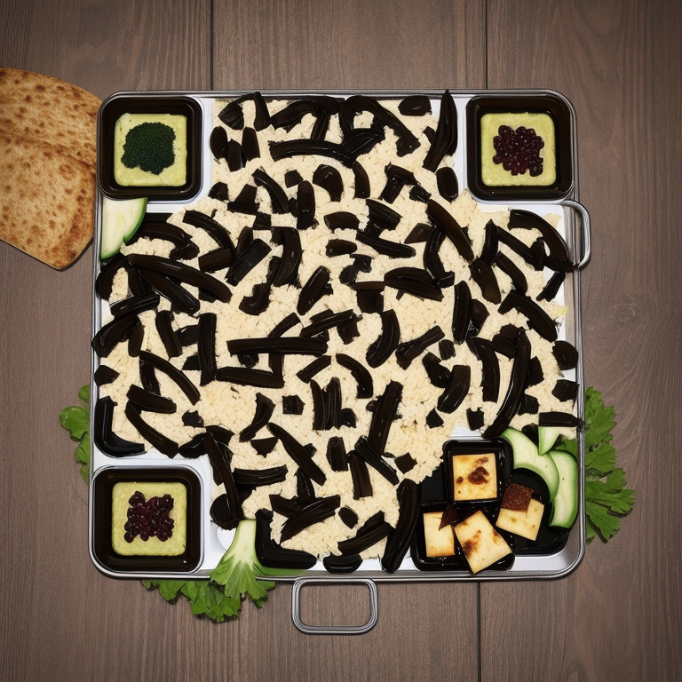
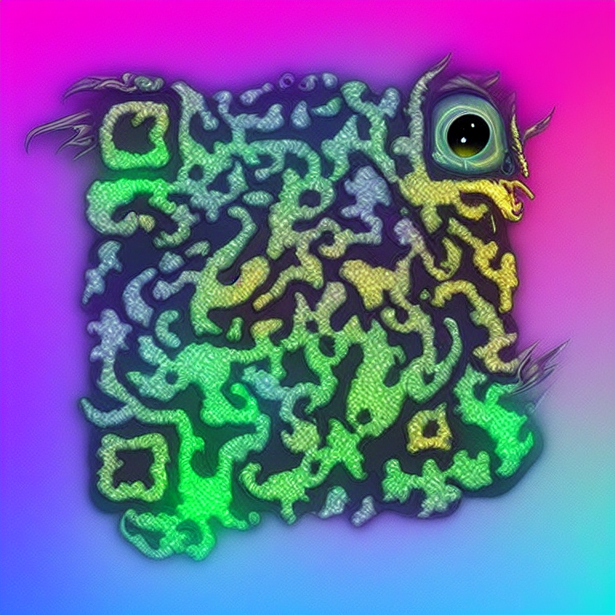
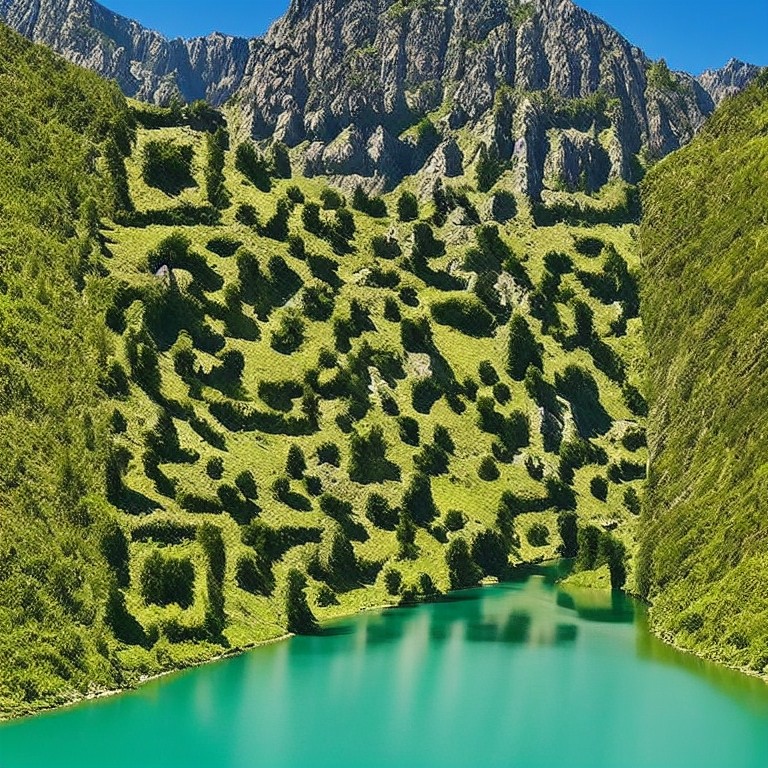
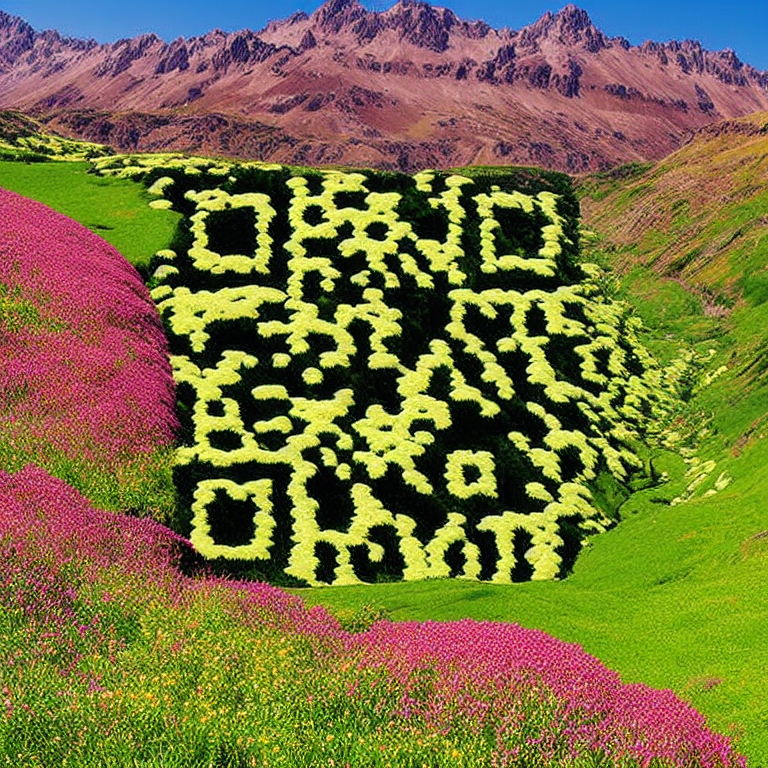
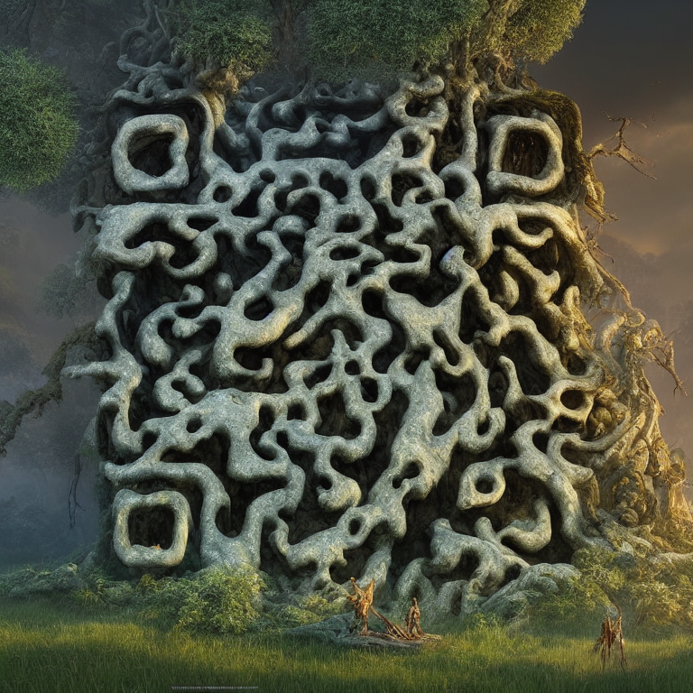

# AI-Powered QR Code Generator 🎨


Generate beautiful, artistic QR codes using Stable Diffusion and ControlNet. This tool transforms ordinary QR codes into stunning artwork while maintaining their functionality.

## 📌 Sample QR Codes











---

## 🌟 Features
- **QR Code Generation**: Create functional QR codes from any URL or text.
- **Artistic Transformation**: Convert plain QR codes into artistic images.
- **Dual Input Methods**:
  - *Text-to-Image*: Generate art using text prompts.
  - *Image-to-Image*: Use reference images for style transfer.
- **Customization Options**:
  - Control strength adjustment.
  - Negative prompt support.
  - Multiple artistic styles.
- **Scan Verification**: Built-in QR code validation to ensure functionality.

---

## 🚀 Getting Started

### Prerequisites
- Python 3.8+
- CUDA-compatible GPU (recommended)
- 8GB+ GPU VRAM for optimal performance

### Installation
1. **Clone the repository:**
   ```bash
   git clone https://github.com/Huzaib/ai-generated-qr-code.git
   cd ai-generated-qr-code
   ```

2. **Create and activate a virtual environment:**
   ```bash
   python -m venv venv
   source venv/bin/activate  # On Windows use: venv\Scripts\activate
   ```

3. **Install dependencies:**
   ```bash
   pip install -r requirements.txt
   ```

4. **Download required models:**
   Place models in the appropriate directory and mention them in the app.py file.

### Usage
1. **Start the web interface using gradio:**
   ```bash
   python app.py
   ```

---

## 💡 How to Use
### **Basic QR Code Generation**:
1. Enter your URL or text in the input field.
2. Click "Generate QR Code".

### **Artistic Generation**:
1. Choose between text prompt or image input.
2. Adjust control strength (0-1).
3. Add negative prompts (optional).
4. Click "Generate".

---

## 🎨 Example Prompts
Here are some effective prompt examples:
- "Cyberpunk city with neon lights and rain"
- "Watercolor landscape with mountains and sunset"
- "Abstract geometric patterns in vibrant colors"
- "Vintage steampunk machinery with brass and copper"

---


### **Performance**
- **Generation Time**: ~5-10 seconds per image
- **Resolution**: 768x768 pixels
- **Supported Formats**: PNG, JPEG

### **Results**
| Style         | Success Rate | Scan Reliability |
|--------------|-------------|------------------|
| Photorealistic | 95%         | High             |
| Abstract      | 90%         | Medium-High      |
| Artistic      | 85%         | Medium           |

---

## 🤝 Contributing
Contributions are welcome! Please feel free to submit a Pull Request.

1. **Fork the repository**
2. **Create your feature branch:**
   ```bash
   git checkout -b feature/AmazingFeature
   ```
3. **Commit your changes:**
   ```bash
   git commit -m 'Add some AmazingFeature'
   ```
4. **Push to the branch:**
   ```bash
   git push origin feature/AmazingFeature
   ```
5. **Open a Pull Request**

---

## 📝 License
This project is licensed under the MIT License - see the [LICENSE](LICENSE) file for details.

---

## 🙏 Acknowledgments
- **ControlNet** for the amazing control mechanisms.
- **QR Code Monster** for the specialized QR code ControlNet.
- **Stable Diffusion** for the base image generation.

---

## 📧 Contact
- **Huzaib** - [@Huzaib](https://github.com/Huzaib)
- **Project Link**: [AI QR Code Generator](https://github.com/Huzaib/ai-generated-qr-code)

---

## ⚠️ Disclaimer
This tool is for educational and creative purposes. Please ensure you have the right to use any generated content and respect copyright laws when using reference images.